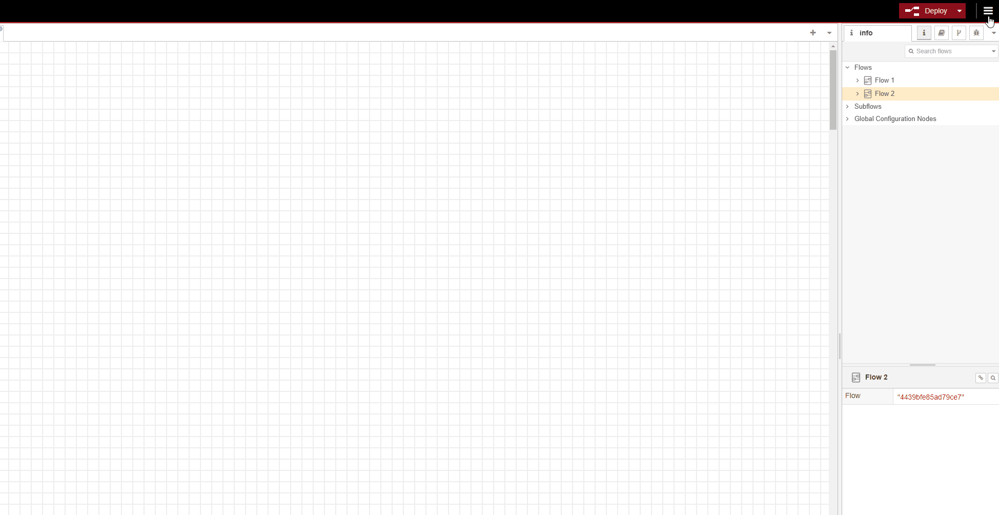

# MakerAdvent 2024 - Day 10 🎄

Welcome to Day 10 of **MakerAdvent 2024**! This project is part of a 24-day journey to celebrate being a maker during the holiday season. Each day brings a new challenge, project, tool, idea and a chance to learn, create, and share.

---

## 🎯 Project Overview

**Day 10 Sending a photo to ntfy.sh:**  
The goal today is to send a photo, captured using a Raspberry Pi Camera, to ntfy.sh using Node-RED.

Here is a [video](https://youtu.be/xtkpPKeXc8s) showing how the project works.

---

## 🚀 Getting Started

### Prerequisites

For today, you will need

- Any model of Raspberry Pi
- Raspberry Pi Camera connected
- Node-RED installed on your Raspberry Pi

Take a look at [day nine of Maker Advent](https://youtu.be/xc2CBeLp_8A) to get an idea on how Node-RED works with ntfy.sh

The JSON file inside this repository contains all of the nodes needed to create the project. All you need to do is copy the JSON code and import it into Node-RED. Here is a quick GIF to show how to do it.

Enjoyed this project? Check out the rest of **MakerAdvent 2024** on [YouTube](https://youtube.com/playlist?list=PLl7sf03jEHOQ-iI5y5vw6luiuBprks3Bx&si=iQWFclF5UEtYOykv)!  

**Happy Hacking!** 🎉